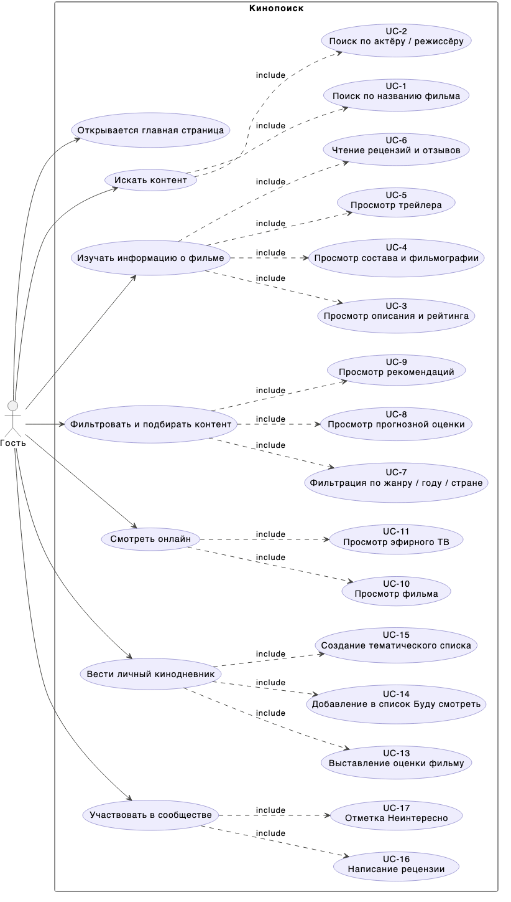

# Отчёт по лабораторной работе №3

## 1. Текст задания

1. Тестовое покрытие должно быть сформировано на основании набора прецедентов [kinopoisk.ru](https://www.kinopoisk.ru).
2. Тестирование должно осуществляться автоматически — с помощью системы автоматизированного тестирования **Selenium**.
3. Шаблоны тестов должны формироваться при помощи **Selenium IDE** и исполняться при помощи **Selenium RC** в браузерах **Firefox** и **Chrome**.
4. Предполагается, что тестируемый сайт использует динамическую генерацию элементов на странице — выбор элементов в DOM должен осуществляться не на основании их ID, а с помощью **XPath**.

## 2. UseCase-диаграмма

**Описание прецедентов:**

| Прецедент | Группа | Описание |
|-----------|--------|----------|
| Открывается главная страница | — | Гость открывает сайт и видит главную страницу с поисковой строкой |
| UC-1 | Искать контент | Поиск по названию фильма; результаты содержат карточки фильмов |
| UC-2 | Искать контент | Поиск по имени актёра/режиссёра; результаты содержат карточки персон с фильмографией |
| UC-3 | Изучать информацию | Просмотр страницы фильма: название, рейтинг, синопсис |
| UC-4 | Изучать информацию | Просмотр состава (актёры, режиссёр) и переход к фильмографии |
| UC-5 | Изучать информацию | Просмотр трейлера на странице фильма |
| UC-6 | Изучать информацию | Переход к разделу рецензий и отзывов |
| UC-7 | Фильтровать контент | Фильтрация каталога по жанру, году и стране |
| UC-8 | Фильтровать контент | Просмотр списка популярных/ожидаемых фильмов |
| UC-9 | Фильтровать контент | Блок рекомендаций/похожих фильмов на карточке |
| UC-10 | Смотреть онлайн | Доступность кнопки «Смотреть» и открытие плеера или витрины покупки |
| UC-11 | Смотреть онлайн | Список эфирных ТВ-каналов на hd.kinopoisk.ru |
| UC-13 | Кинодневник | Оценка фильма — гостю показывается окно входа |
| UC-14 | Кинодневник | Кнопка «Буду смотреть» — гостю показывается окно входа |
| UC-15 | Кинодневник | Создание тематического списка — гостю показывается окно входа |
| UC-16 | Сообщество | Написание рецензии — гостю показывается окно входа или редирект |
| UC-17 | Сообщество | Отметка «Неинтересно» — гостю показывается окно входа (если кнопка доступна) |

## 3. CheckList тестового покрытия

| # | Прецедент | Тестовый класс | Покрыт | Firefox | Chrome |
|---|-----------|----------------|--------|---------|--------|
| — | Главная страница загружается | `HomeAndSearchTest` | ✅ | ✅ | ✅ |
| UC-1 | Поиск по названию фильма | `HomeAndSearchTest` | ✅ | ✅ | ✅ |
| UC-2 | Поиск по актёру / режиссёру | `HomeAndSearchTest` | ✅ | ✅ | ✅ |
| UC-3 | Просмотр описания и рейтинга | `FilmInfoTest` | ✅ | ✅ | ✅ |
| UC-4 | Просмотр состава и фильмографии | `FilmInfoTest` | ✅ | ✅ | ✅ |
| UC-5 | Просмотр трейлера | `FilmInfoTest` | ✅ | ✅ | ✅ |
| UC-6 | Чтение рецензий и отзывов | `FilmInfoTest` | ✅ | ✅ | ✅ |
| UC-7 | Фильтрация по жанру / году / стране | `CatalogFilterTest` | ✅ | ✅ | ✅ |
| UC-8 | Просмотр прогнозной оценки | `CatalogFilterTest` | ✅ | ✅ | ✅ |
| UC-9 | Просмотр рекомендаций | `CatalogFilterTest` | ✅ | ✅ | ✅ |
| UC-10 | Просмотр фильма (кнопка + плеер) | `WatchTest` | ✅ | ✅ | ✅ |
| UC-11 | Просмотр эфирного ТВ | `WatchTest` | ✅ | ✅ | ✅ |
| UC-12 | *(не определён в задании)* | — | — | — | — |
| UC-13 | Выставление оценки фильму | `DiaryAndSocialTest` | ✅ | ✅ | ✅ |
| UC-14 | Добавление в «Буду смотреть» | `DiaryAndSocialTest` | ✅ | ✅ | ✅ |
| UC-15 | Создание тематического списка | `DiaryAndSocialTest` | ✅ | ✅ | ✅ |
| UC-16 | Написание рецензии | `DiaryAndSocialTest` | ✅ | ✅ | ✅ |
| UC-17 | Отметка «Неинтересно» | `DiaryAndSocialTest` | ✅ | ✅ | ✅ |

## 4. Описание набора тестовых сценариев

### 4.1 HomeAndSearchTest — Главная страница и поиск

**Тестируемая страница:** `https://www.kinopoisk.ru/`

---

**Сценарий: Главная страница загружается**
- Шаги: открыть главную страницу Кинопоиска.
- Ожидаемый результат: страница содержит строку поиска (поле ввода).
- Проверка: `MainPage.isLoaded()` возвращает `true`.

---

**UC-1: Поиск по названию фильма**
- Шаги: открыть главную → ввести «Интерстеллар» в строку поиска → дождаться результатов → открыть первую карточку фильма.
- Ожидаемый результат: в результатах присутствуют карточки фильмов; открытая карточка содержит непустое название.
- Проверка: `SearchResultsPage.hasFilmResults()` и `FilmPage.title().isNotBlank()`.

---

**UC-2: Поиск по актёру / режиссёру**
- Шаги: открыть главную → ввести «Кристофер Нолан» → дождаться результатов → открыть первую карточку персоны.
- Ожидаемый результат: в результатах есть карточки людей; карточка персоны содержит имя и блок фильмографии.
- Проверка: `hasNameResults()`, `NamePage.name().isNotBlank()`, `hasFilmography()`.

---

### 4.2 FilmInfoTest — Информация о фильме

**Тестируемая страница:** `https://www.kinopoisk.ru/film/258687/` (фильм «Интерстеллар»)

---

**UC-3: Описание и рейтинг**
- Шаги: открыть карточку фильма.
- Ожидаемый результат: присутствуют название, рейтинг и синопсис.
- Проверка: `title().isNotBlank()`, `hasRating()`, `hasSynopsis()`.

---

**UC-4: Состав и фильмография**
- Шаги: открыть карточку фильма → кликнуть на первого актёра из блока «В главных ролях».
- Ожидаемый результат: блок актёров присутствует; на странице персоны отображается фильмография.
- Проверка: `hasCast()`, `NamePage.hasFilmography()`.

---

**UC-5: Просмотр трейлера**
- Шаги: открыть карточку фильма → кликнуть по кнопке/превью трейлера.
- Ожидаемый результат: кнопка трейлера видна; после клика появляется плеер.
- Проверка: `hasTrailer()`, `playTrailer()` возвращает `true`.

---

**UC-6: Рецензии и отзывы**
- Шаги: открыть карточку фильма → перейти по ссылке на раздел рецензий.
- Ожидаемый результат: ссылка на рецензии есть; страница рецензий содержит хотя бы одну рецензию.
- Проверка: `hasReviewsLink()`, `ReviewsPage.hasReviews()`.

---

### 4.3 CatalogFilterTest — Каталог и фильтры

---

**UC-7а: Наличие фильтров в каталоге**
- Страница: `https://www.kinopoisk.ru/lists/movies/`
- Шаги: открыть каталог, дождаться загрузки.
- Ожидаемый результат: в каталоге отображаются карточки (>0); доступен хотя бы один фильтр (жанр, год или страна).
- Проверка: `resultCount() > 0`, наличие хотя бы одного из `hasGenreFilter()`, `hasYearFilter()`, `hasCountryFilter()`.

---

**UC-7б: Применение фильтра по жанру «Драма»**
- Страница: `https://www.kinopoisk.ru/lists/movies/genre--drama/`
- Ожидаемый результат: отфильтрованный список не пуст.
- Проверка: `resultCount() > 0`.

---

**UC-8: Рейтинг ожиданий (популярные фильмы)**
- Страница: `https://www.kinopoisk.ru/lists/movies/popular-films/`
- Ожидаемый результат: список доступен и содержит карточки.
- Проверка: `resultCount() > 0`.

---

**UC-9: Блок рекомендаций на карточке фильма**
- Страница: `https://www.kinopoisk.ru/film/258687/`
- Шаги: открыть карточку → проверить наличие блока похожих фильмов.
- Ожидаемый результат: блок рекомендаций содержит карточки фильмов, отличных от текущего.
- Проверка: `hasRecommendations(currentFilmId = "258687")`.

---

### 4.4 WatchTest — Просмотр онлайн

---

**UC-10а: Наличие кнопки «Смотреть» на карточке**
- Страница: `https://www.kinopoisk.ru/film/258687/`
- Ожидаемый результат: кнопка «Смотреть» присутствует ИЛИ страница `/watch/` отображает плеер/витрину покупки.
- Проверка: `hasWatchButton()` или `WatchPage.hasPlayerOrPurchaseGate()`.

---

**UC-10б: Открытие плеера / витрины покупки**
- Страница: `https://www.kinopoisk.ru/film/258687/watch/`
- Шаги: перейти напрямую на страницу просмотра.
- Ожидаемый результат: для неавторизованного пользователя отображается плеер или предложение оформить подписку.
- Проверка: `hasPlayerOrPurchaseGate()`.

---

**UC-11: Список эфирных ТВ-каналов**
- Страница: `https://hd.kinopoisk.ru/channels`
- Ожидаемый результат: раздел открывается и содержит хотя бы один ТВ-канал.
- Проверка: `tvChannelCount() > 0`.

---

### 4.5 DiaryAndSocialTest — Личный кинодневник и сообщество

**Базовая страница:** `https://www.kinopoisk.ru/film/258687/`  
Все действия выполняются от лица гостя (не авторизован). Ожидаемое поведение — показ диалога входа.

---

**UC-13: Выставление оценки**
- Шаги: открыть карточку фильма → кликнуть на звёздочку/кнопку оценки.
- Ожидаемый результат: появляется форма/модал входа.
- Проверка: `AuthGate.waitShown()`.

---

**UC-14: Добавление в «Буду смотреть»**
- Шаги: открыть карточку фильма → кликнуть «Буду смотреть».
- Ожидаемый результат: появляется форма входа.
- Проверка: `AuthGate.waitShown()`.

---

**UC-15: Создание тематического списка**
- Страница: `https://www.kinopoisk.ru/mykp/movies/`
- Ожидаемый результат: гость перенаправляется на страницу входа или показывается диалог авторизации.
- Проверка: `AuthGate.waitShown()`.

---

**UC-16: Написание рецензии**
- Страница: `https://www.kinopoisk.ru/film/258687/addreview/`
- Ожидаемый результат: гость перенаправляется прочь со страницы или показывается диалог входа.
- Проверка: URL не содержит `addreview` ИЛИ `AuthGate.waitShown()`.

---

**UC-17: Отметка «Неинтересно»**
- Шаги: открыть главную страницу → найти кнопку «Неинтересно» через XPath → кликнуть.
- Ожидаемый результат: если кнопка не показывается гостю — тест засчитывается (корректное поведение). Если показывается — после клика должен появиться диалог входа.
- Проверка: `buttons.isEmpty()` ИЛИ `AuthGate.waitShown()`.

## 5. Результаты тестирования

**Дата запуска:** 12 июня 2026 г.  
**Окружение:** macOS Darwin 25.4.0, Firefox + Chrome  
**Инструмент:** Selenium WebDriver 4.x, JUnit 5, Kotlin, Gradle

### Сводная таблица

| Тестовый класс | Всего | Пройдено | Упало | Пропущено | Время (с) |
|----------------|-------|----------|-------|-----------|-----------|
| `HomeAndSearchTest` | 6 | **6** | 0 | 0 | 25,9 |
| `FilmInfoTest` | 8 | **8** | 0 | 0 | 36,8 |
| `CatalogFilterTest` | 8 | **8** | 0 | 0 | 67,7 |
| `WatchTest` | 6 | **6** | 0 | 0 | 18,3 |
| `DiaryAndSocialTest` | 10 | **10** | 0 | 0 | 41,0 |
| **ИТОГО** | **38** | **38** | **0** | **0** | **~189,7** |

### Детальные результаты

| Тест | Firefox (с) | Chrome (с) | Статус |
|------|-------------|------------|--------|
| Главная страница загружается | 3,35 | 2,29 | ✅ PASS |
| UC-1: поиск по названию фильма | 5,27 | 3,95 | ✅ PASS |
| UC-2: поиск по актёру / режиссёру | 5,48 | 5,54 | ✅ PASS |
| UC-3: описание и рейтинг | 3,53 | 2,47 | ✅ PASS |
| UC-4: состав и фильмография | 3,86 | 2,43 | ✅ PASS |
| UC-5: просмотр трейлера | 8,92 | 6,71 | ✅ PASS |
| UC-6: рецензии и отзывы | 4,84 | 4,07 | ✅ PASS |
| UC-7: фильтры доступны | 4,13 | 3,45 | ✅ PASS |
| UC-7: применение фильтра по жанру | 4,35 | 3,11 | ✅ PASS |
| UC-8: рейтинг ожиданий | 3,57 | 2,27 | ✅ PASS |
| UC-9: блок рекомендаций | 38,91 | 7,90 | ✅ PASS |
| UC-10: кнопка «Смотреть» | 3,99 | 2,23 | ✅ PASS |
| UC-10: плеер / витрина покупки | 3,85 | 2,40 | ✅ PASS |
| UC-11: список ТВ-каналов | 3,49 | 2,33 | ✅ PASS |
| UC-13: оценка требует входа | 3,98 | 4,27 | ✅ PASS |
| UC-14: «Буду смотреть» требует входа | 4,70 | 2,74 | ✅ PASS |
| UC-15: создание списка требует входа | 4,70 | 3,73 | ✅ PASS |
| UC-16: написание рецензии требует входа | 3,74 | 5,28 | ✅ PASS |
| UC-17: отметка «Неинтересно» требует входа | 4,35 | 3,53 | ✅ PASS |

## 6. Выводы

В рамках работы было сформировано и автоматизировано тестовое покрытие для основ-
ных гостевых сценариев сайта [kinipoisk.ru](https://www.kinopoisk.ru). Покрытие включает навигацию по разделам,
открытие тем, переходы по служебным ссылкам, возврат на главную страницу и отправку
поисковой формы.
По результатам автоматического тестирования можно сделать следующие выводы:
• базовые сценарии чтения и навигации по сайту в целом работоспособны;
• все реализованные пользовательские потоки успешно выполняются в двух браузерах;
• набор тестов покрывает как простые переходы, так и более сложные составные прецеден-
ты: поиск, навигацию между уровнями интерфейса и возврат к предыдущему контексту;
Итог: основная часть функциональности сайта для гостя протестирована успешно, а фи-
нальный набор автотестов проходит полностью без ошибок.
